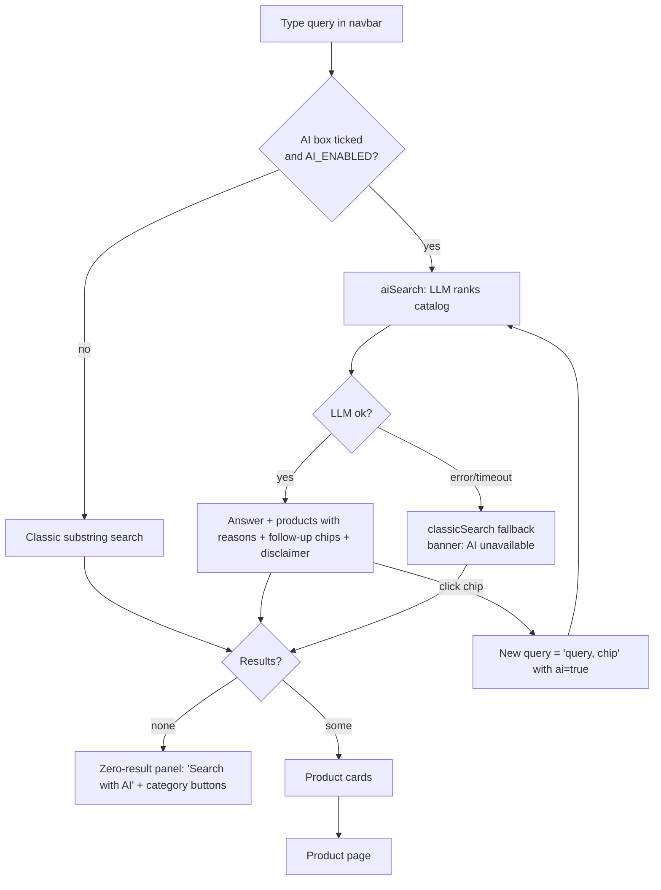
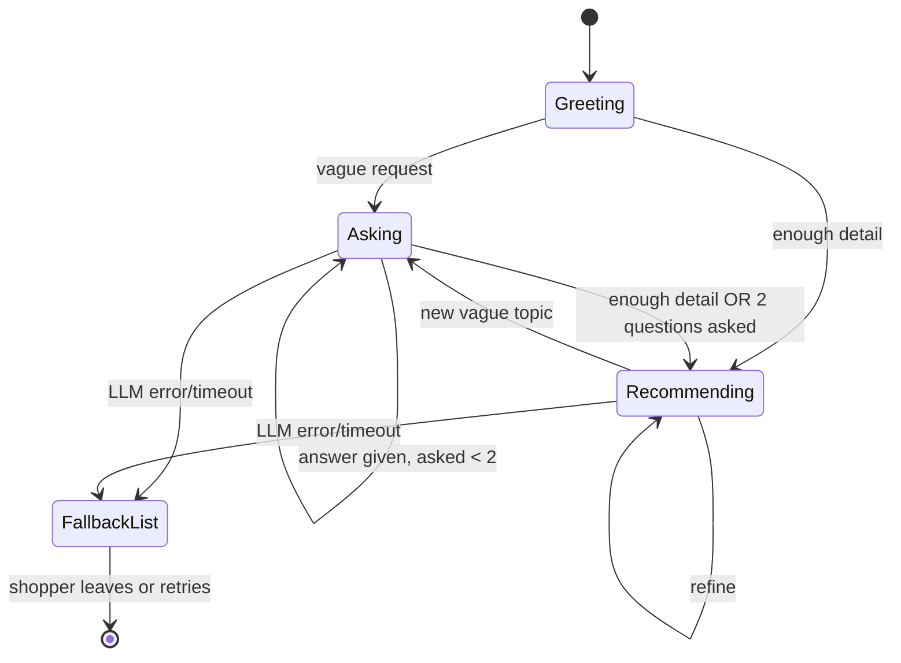
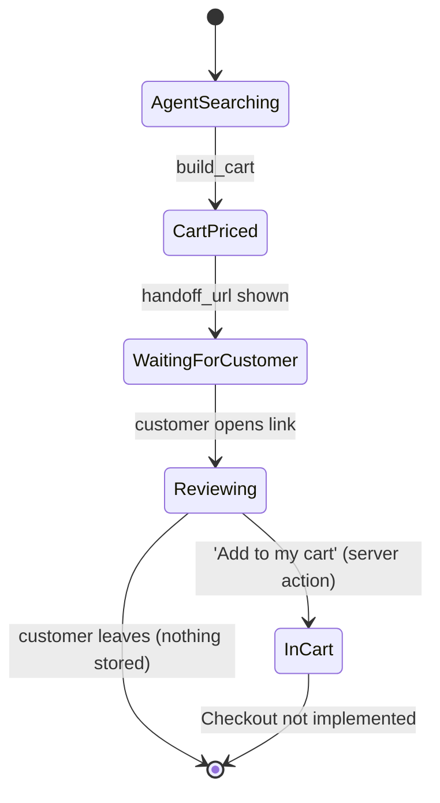
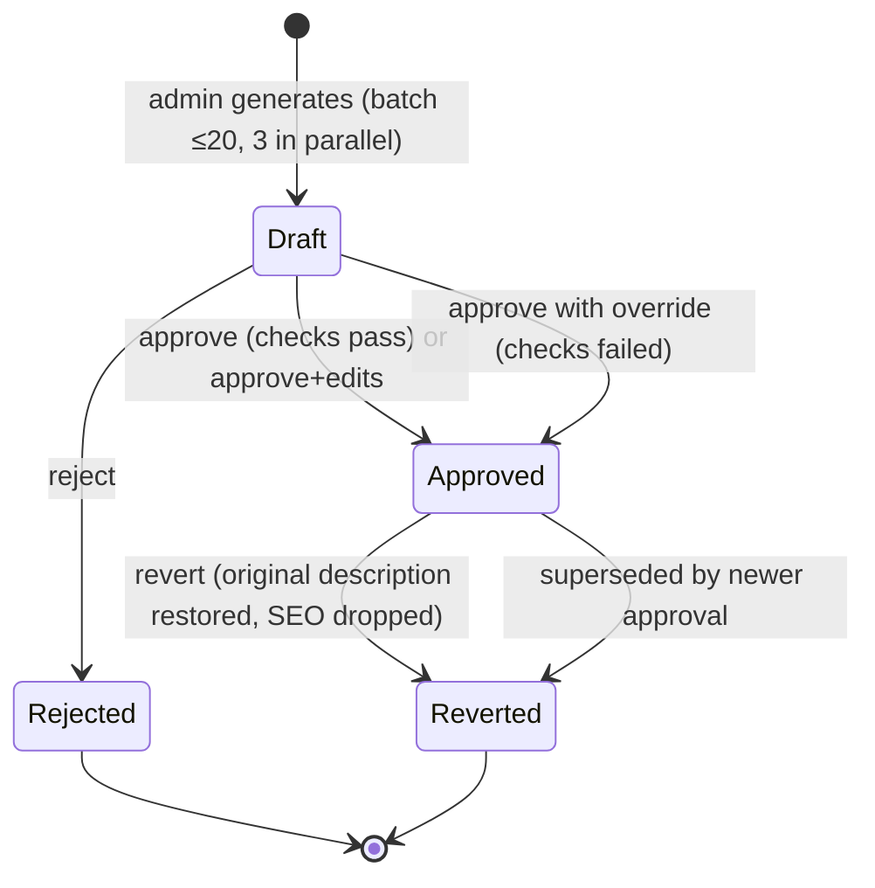

# 02 — User Experience and Commerce Flows

## 1. Site map (what a visitor can do)

| Page | Route | Source | Notes |
|---|---|---|---|
| Home / catalog | `/` | `src/app/page.tsx` | Product grid + `ItemList` JSON-LD |
| Product detail | `/products/[id]` | `src/app/products/[id]/page.tsx` | Product + breadcrumb JSON-LD; add to cart; logs AI-bot visits |
| Search | `/search?query=…[&ai=true]` | `src/app/search/page.tsx` | Classic or AI mode; zero-result UX; follow-up chips |
| Cart | `/cart` | `src/app/cart/page.tsx` | Quantity edit; **"Checkout" button has no handler** |
| Cart handoff | `/cart/handoff?items=id:qty,…` | `src/app/cart/handoff/page.tsx` | Review + "Add to my cart"; `noindex` |
| Add product | `/add-product` | `src/app/add-product/page.tsx` | Creates a product. Guarded only by `getServerSession`, which is a mock that is always truthy → **effectively open to anyone** |
| Admin: enrichment | `/admin/enrichment` | `src/app/admin/enrichment/page.tsx` | Token-gated UI |
| Admin: bots | `/admin/bots` | `src/app/admin/bots/page.tsx` | Token-gated UI |
| Assistant | floating widget on every page | `src/components/AssistantChat.tsx` | Rendered only if `AI_ENABLED=true` (`src/app/layout.tsx`) |

The navbar shows an "AI" checkbox next to the search box only when AI is enabled (`src/app/Navbar/Navbar.tsx`).

## 2. Journey A — Product discovery with AI search

**Status: Implemented.** Trigger: shopper types a query and ticks "AI", or clicks "Search with AI" on a zero-result page.

With `AI_BACKEND=enthusiast` the request goes to Enthusiast's Product Search agent first (about 25 s; the page shows the `loading.tsx` skeleton meanwhile) and the answer is plain text with no per-product reasons or follow-up chips; on failure it falls back to the direct LLM (reasons and chips present), then to keyword results. In the worst case the two AI attempts add up (about 45 s + 45 s) before the fallback renders.

What the shopper sees: an info banner *"AI-powered search results. Verify prices before purchasing."*, an "AI Response" box, "Refine:" chips, and cards with a one-line reason. Prices always come from the catalog.

**Caveat (observed):** input is stripped to ASCII-safe characters (`sanitizeQuery` uses `\w`), so accented letters are removed. Italian/French queries lose characters such as `è`, `à` — **Partial** for a multilingual experience.

## 3. Journey B — Conversational assistant

**Status: Implemented.** A floating button opens a chat panel. Greeting and quick replies ("A gift", "Something for the evening", "A bag for work") are UI copy.

State machine (server-side decision per turn):

*The rules below describe the direct backend. On the Enthusiast backend the agent decides when to ask: `mode` is `recommend` when its reply names catalog products, else `ask`; there are no quick-reply chips, the reply is longer plain text (up to 1500 characters) and the conversation continues server-side through a signed `conversation_ref`.*

- **Ask mode:** one short question + 2–4 tappable quick replies, no products.
- **Recommend mode:** 1–4 products, each with a reason (≤15 words), reply ≤60 words, in the customer's language.
- **Forced recommendation** after `MAX_CLARIFYING_QUESTIONS = 2` (`src/lib/ai/chat.ts`).
- **Memory:** last 12 turns in `sessionStorage` (`assistant-chat-v1`). Direct backend: the server is stateless and resends the turns. Enthusiast backend: the conversation lives in Enthusiast; the `conversation_ref` is held in component state only, so a page reload starts a new Enthusiast conversation while the old bubbles remain visible.
- **Reset** clears the conversation.

## 4. Journey C — Delegated shopping through an external assistant

**Status: Implemented server-side; third-party client behaviour To validate.**

1. Shopper asks an AI assistant (e.g. a Custom GPT or MCP-enabled client) for a product.
2. The agent calls `GET /api/products` or MCP `search_products`, optionally `get_product`.
3. The agent calls `POST /api/cart/preview` or MCP `build_cart` with product ids and quantities (no prices).
4. The shop returns line totals, subtotal, `errors[]`, `requires_customer_confirmation: true` and a `handoff_url`.
5. The agent shows the summary and the link. **The shopper opens the link**, reviews, and presses *Add to my cart*.
6. The shopper continues in the normal cart.

Safeguards: quantity 1–10 per line, max 10 lines, unknown ids reported in `errors`, merged duplicates, page is `noindex`.

## 5. Journey D — Transaction (cart → checkout → order)

| Step | Status | Evidence |
|---|---|---|
| Add to cart from product page | Implemented | `src/components/AddToCartButton.tsx`, `src/app/cart/actions.ts` |
| Edit quantity / remove | Implemented | `src/app/cart/CartEntry.tsx` |
| Cart persistence | **Partial** | `localCartId` cookie; carts live in process memory (`mock-db.ts`), lost on restart, not shared across replicas |
| Checkout, address, shipping, tax, payment | **Not implemented** | `Checkout` button is inert |
| Order creation / confirmation email | **Not implemented** | — |
| Guest → account cart merge | **Partial** | `mergeAnonymousCartIntoUserAccount` exists in `src/lib/db/cart.ts`; auth is a mock |

Because the transactional path stops at the cart, all "irreversible action" rules in this documentation are **design requirements for when checkout is added**, not features.

## 6. Journey E — Post-sale and support

**Not implemented.** No order status, returns, refunds, tracking or support tools exist in the Node app. Enthusiast upstream ships plugins in these areas (e.g. `enthusiast/plugins/enthusiast-agent-order-intake`, `enthusiast-agent-user-manual-search`), but they are **not connected** to this storefront.

## 7. Journey F — Merchant: enrichment with human approval

The admin UI (488 lines) supports batch generate, inline edit, override, revert, and an audit trail. Approved SEO title/description/tags/attributes/categories feed the product page and JSON-LD (`src/lib/seo/jsonld.ts`, `deriveCategories`).

## 8. Error states, fallbacks and handoff

| Situation | Behaviour | Where |
|---|---|---|
| `AI_ENABLED` not `true` | No AI toggle, no widget; `/api/ai/chat` → 403; `/api/ai/search` answers with classic search | `layout.tsx`, routes |
| Message not about shopping (code, maths, general questions) | Short refusal in the customer's language + shopping quick replies; no model or agent call (`scope.ts`) | `scope.ts`, `chat.ts`, `search.ts` |
| Enthusiast error, timeout or reply naming no catalog product | Next step: direct LLM, then keyword search | `search.ts`, `chat.ts` |
| LLM error, timeout, or no key | Search: classic results, `fallback_used: true`, disclaimer. Chat: keyword list + "assistant is unavailable" | `search.ts`, `chat.ts` |
| LLM returns unknown ids | Silently dropped (ids re-resolved against catalog) | `byId` maps |
| Query contains injection pattern or sensitive word | 400 with *"Query contains potentially unsafe content"* / *"…sensitive information"* | `validator.ts` |
| Rate limit exceeded | HTTP 429 + `Retry-After`; chat UI shows "Too many requests" | `middleware.ts`, `AssistantChat.tsx` |
| Cart preview with unknown id / bad quantity | Line skipped and reported in `errors[]` | `agentApi.ts` |
| Empty handoff link | "Nothing to review" page | `handoff/page.tsx` |
| **Human escalation** | **Not implemented.** No operator queue, no "talk to a person" action | — |

**Gap:** false positives. The sensitive-word filter rejects harmless queries containing "token", "secret", "password" (e.g. "secret santa gift"), and shows a security-flavoured error to a shopper.

## 9. UX criteria for a trustworthy conversational commerce experience

Status against each criterion:

| Criterion | Status | Evidence / gap |
|---|---|---|
| AI is labelled as AI | Implemented | Search banner and disclaimer; chat widget is explicitly "assistant" |
| Prices and facts come from the catalog, not the model | Implemented (products) / Partial (free text) | Ids re-resolved; the model's free-text reply is not fact-checked |
| Each recommendation is explained | Implemented | `reasons` |
| User keeps control of money actions | Implemented up to cart | Handoff requires a click; checkout absent |
| Graceful degradation | Implemented | Fallback in both search and chat |
| Refinement without retyping | Implemented | Chips and quick replies |
| Keyboard/screen-reader support | Partial | `aria-label`s, focus management in the widget; not audited — **To validate** |
| Privacy expectations visible | **Not implemented** | No notice that chat text goes to a third-party LLM |
| Way to reach a human | **Not implemented** | — |
| Feedback (thumbs up/down) | **Not implemented** | — |
