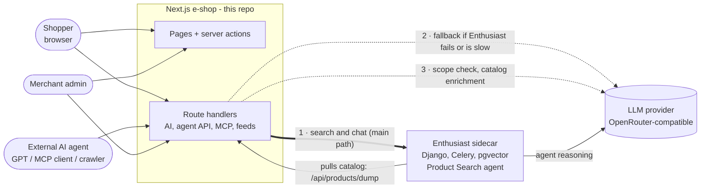
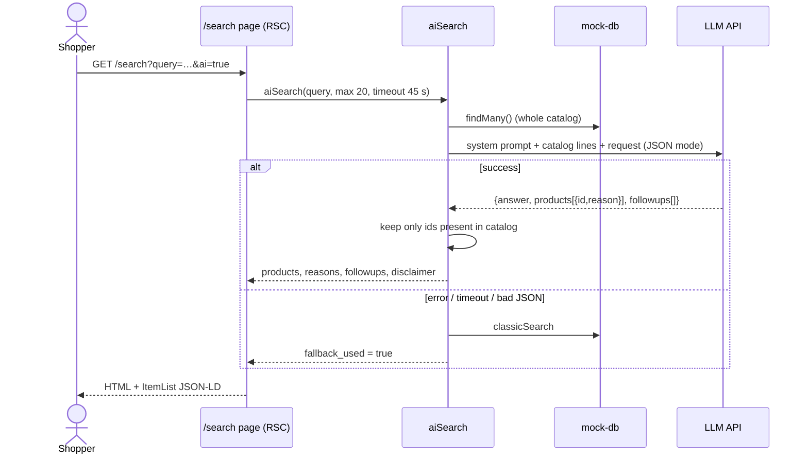
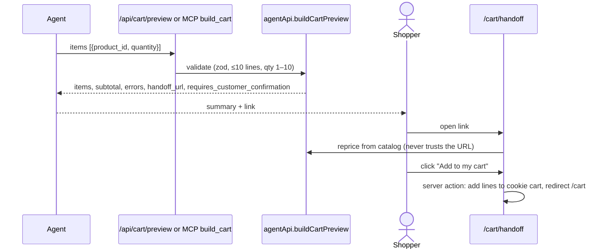
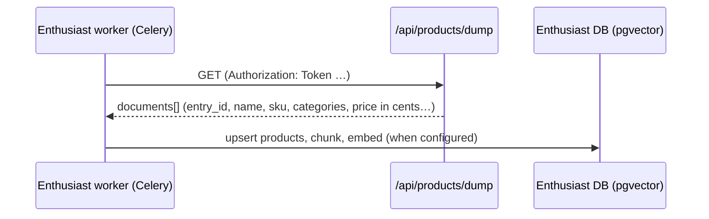
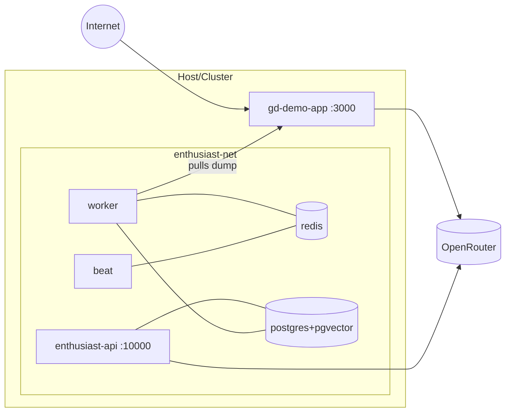

# 03 — System Architecture

## 1. Summary

A **single Next.js 14 application** (App Router, `output: "standalone"`) serving pages, server actions and route handlers. There is no separate backend service, queue or database in the Node app: catalog and carts are in-process mocks, and AI artefacts persist to a JSON file. The LLM is reached over HTTPS (OpenRouter-compatible API). Enthusiast (Django + Celery + Postgres/pgvector + Redis) is a **sidecar** defined in `compose.enthusiast.yml`; with `AI_BACKEND=enthusiast` its Product Search agent serves AI search and chat (see doc 04 §2.3), otherwise the app works without it.

| Layer | Technology | Evidence |
|---|---|---|
| Web + API | Next.js 14.0.4, React 18, TypeScript 5 | `package.json` |
| UI | Tailwind, daisyUI | `tailwind.config.ts` |
| Validation | Zod | `src/lib/ai/validator.ts`, route handlers |
| Auth | next-auth 4 with a **mock** session | `src/lib/authOptions.ts` |
| Persistence | In-memory mock DB; JSON file store | `src/lib/db/mock-db.ts`, `src/lib/ai/store.ts` |
| Declared schema | Prisma + MongoDB (unused at runtime) | `prisma/schema.prisma`, `src/lib/db/prisma.ts` |
| LLM | OpenRouter/OpenAI-compatible `chat/completions`, default model `~deepseek/deepseek-v4-flash-latest` | `src/lib/ai/llm.ts` |
| Tests | Vitest, 80 tests / 10 files | `tests/ai/` |
| Packaging | Docker (multi-stage), Helm chart | `Dockerfile`, `helm/` |

## 2. Module map

```
src/
  app/
    layout.tsx, page.tsx, search/, products/[id]/, cart/, add-product/   # storefront
    cart/handoff/            # agent-prepared cart review + confirm
    admin/{enrichment,bots}/ # token-gated admin UIs
    api/ai/{search,chat,enrich,bots,health}   # AI endpoints
    api/products[, /[id], /dump]              # agent REST + Enthusiast dump
    api/cart/preview, api/mcp                 # cart pricing, MCP server
    openapi.json, llms.txt, llms-full.txt, feed/products.{json,xml}, sitemap.ts, robots.ts
  components/  AssistantChat, AdminTokenGate, useAdminFetch, ProductCard, ...
  lib/
    ai/   llm, config, client(Enthusiast), enthusiastAgent, scope, search, chat, enrichment, validator, categories, store, types
    seo/  jsonld, searchList
    agentApi, bots, adminAuth, site, db/{mock-db,cart,prisma}
  middleware.ts   # security headers + in-memory rate limit
tests/ai/          # 9 test files
enthusiast/        # vendored upstream copy + local patches + custom plugin eshop_source
scripts/           # setup.sh (fresh-clone start), enthusiast_bootstrap.py
```

## 3. System context



Reading guide: the thick arrow is the main path for AI search and chat (`AI_BACKEND=enthusiast`). The dotted arrows are direct LLM calls made by the shop itself, for three reasons: (2) the fallback when Enthusiast errors or exceeds its 45 s limit (then keyword search as the last resort); (3) the *scope check* that declines non-shopping questions and the *catalog enrichment* workflow, because Enthusiast's enrichment agent processes vendor product sheets and is not enabled in this sidecar. With `AI_BACKEND=direct`, arrow 1 is skipped and arrow 2 becomes the main path. Enthusiast in turn calls the LLM provider for its agent's reasoning.

Not present (so not drawn): payment gateway, OMS, ERP/PIM/CMS/CRM, email, analytics. **Not documented in the repository** whether any is planned.

## 4. Container / component view

```mermaid
flowchart TB
  subgraph Browser
    UI[Storefront UI]
    Chat[AssistantChat<br/>sessionStorage history]
    AdminUI[Admin UIs<br/>token in sessionStorage]
  end
  subgraph NextApp[Next.js process]
    MW[middleware.ts<br/>headers + rate limit]
    Pages[RSC pages]
    Actions[Server actions<br/>cart, handoff confirm]
    AIroutes[/api/ai/*]
    AgentRoutes[/api/products, /api/cart/preview, /api/mcp/]
    Disc[openapi, llms, feeds, sitemap, robots]
    subgraph Lib[lib]
      Val[validator.ts]
      Search[search.ts]
      Chatlib[chat.ts]
      Enrich[enrichment.ts]
      AgentApi[agentApi.ts]
      LLMc[llm.ts]
      Store[store.ts<br/>proposals, SEO, audit, bot visits]
      Cats[categories.ts]
      Mock[(mock-db.ts<br/>products, carts)]
    end
  end
  File[(store.json<br/>DATA_DIR or os tmp)]
  LLM[(LLM API)]
  UI --> Pages & Actions
  Chat --> AIroutes
  AdminUI --> AIroutes
  MW --> AIroutes & AgentRoutes
  AIroutes --> Val --> Search & Chatlib & Enrich
  Search & Chatlib & Enrich --> LLMc --> LLM
  Search & Chatlib & AgentApi & Enrich & Actions --> Mock
  Enrich --> Store --> File
  AgentRoutes --> AgentApi
  Pages --> Cats
  Cats --> Store
```

Responsibilities:

| Component | Responsibility | File |
|---|---|---|
| `middleware.ts` | Security headers; per-IP fixed-window rate limit (60 s): `AI_RATE_LIMIT` (default 10) for `/api/ai/*`, `AGENT_RATE_LIMIT` (default 60) for the agent routes | `src/middleware.ts` |
| `validator.ts` | Query schema, injection/sensitive-word filters, `sanitizeQuery` | `src/lib/ai/validator.ts` |
| `llm.ts` | Single LLM call helper, JSON mode, reasoning disabled, timeout | `src/lib/ai/llm.ts` |
| `search.ts` | Classic search; LLM ranking over the full catalog; fallback | `src/lib/ai/search.ts` |
| `chat.ts` | Turn validation, prompt assembly, clarify/recommend logic, fallback | `src/lib/ai/chat.ts` |
| `enrichment.ts` | Generate, check, approve/reject/revert proposals | `src/lib/ai/enrichment.ts` |
| `agentApi.ts` | Agent-facing product shape (GBP not pence), search scoring, cart pricing | `src/lib/agentApi.ts` |
| `categories.ts` | Regex-derived categories; approved overrides win | `src/lib/ai/categories.ts` |
| `store.ts` | Global singleton store + best-effort JSON persistence | `src/lib/ai/store.ts` |
| `bots.ts` | Known AI bots, detection, visit log (200) | `src/lib/bots.ts` |
| `seo/jsonld.ts` | schema.org builders; `safeJsonLd` escapes `<` | `src/lib/seo/jsonld.ts` |
| `client.ts` | Enthusiast REST client: health, agent/data-set discovery, conversation, ask, task polling | `src/lib/ai/client.ts` |
| `scope.ts` | Scope guard: one fast LLM classification that declines non-shopping messages before any answer; fails open | `src/lib/ai/scope.ts` |
| `enthusiastAgent.ts` | Markdown stripping, catalog-name matching, HMAC-signed conversation refs | `src/lib/ai/enthusiastAgent.ts` |
| `config.ts` | Zod-validated AI config (provider, Enthusiast URL, rate limit) | `src/lib/ai/config.ts` |

**Config note:** `config.ts` models an Ollama/OpenRouter `provider` with model and embedding model, but LLM calls in `llm.ts` read `OPENROUTER_API_KEY`/`OPENAI_API_KEY`, `OPENROUTER_API_BASE` and `AI_SEARCH_MODEL` directly. The provider object is effectively unused for inference.

## 5. Data model

| Entity | Fields | Store |
|---|---|---|
| Product | `id`, `name`, `description`, `price` (pence, int), `imageUrl`, timestamps | `mock-db.ts` array (96 items), mutated by enrichment approval and `add-product` |
| Cart / CartItem | `id`, `userId?`, items (`productId`, `quantity`) | `mock-db.ts` arrays; cookie `localCartId` |
| Session | Always the mock user | `authOptions.ts` |
| EnrichmentProposal | status, proposed/original values, validation, review, metadata | `store.json` (`proposals`) |
| SeoOverride | title, description, tags, attributes, categories, `proposal_id` | `store.json` (`seo`) |
| Original descriptions | For rollback | `store.json` |
| AuditEntry | actor, action, product, proposal (max 500) | `store.json` |
| BotVisit | bot, UA (200 chars), path (max 200 visits) | `store.json` |

`store.json` lives at `${DATA_DIR}/store.json`, default `os.tmpdir()/eshop-data`. Writes are best-effort and errors are swallowed. **Consequences:** catalog edits (including approved descriptions) are in process memory only and are lost on restart, while SEO overrides and audit survive — the two can drift (an approved description could revert on restart while its SEO data remains). **Not documented** whether this is acceptable for the demo.

Prisma's MongoDB schema (`Product`, `Cart`, `CartItem`, `User`, `Account`, `Session`, …) is a leftover from the upstream sample; `DATABASE_URL` is not needed at runtime.

## 6. Main flows

### 6.1 AI search (sequence, direct backend)

With `AI_BACKEND=enthusiast`, `aiSearch` first runs the Enthusiast conversation flow shown in doc 04 §2.3 and only continues with the steps below if that fails or names no catalog product.



Note: `POST /api/ai/search` is the JSON API equivalent; the page calls `aiSearch` directly and therefore **skips** the query validation of the API route (`SearchQuerySchema`) — **Partial** (the page only reads `query` from the URL).

### 6.2 Agent cart handoff



### 6.3 Catalog → Enthusiast



Reference: `enthusiast/server/eshop_source/__init__.py`. The embedding step is upstream behaviour; the current environment reportedly has embeddings unset (memory notes: 1 of 96 chunks embedded) — **To validate** as it is not in the repository.

## 7. Deployment

| Artefact | What it says | Observation |
|---|---|---|
| `Dockerfile` | node:18-alpine multi-stage; standalone server; `PORT 3000` | The health check was a single quoted `curl` string and Alpine has no `curl`, so `gd-demo-app` showed `unhealthy`; **fixed** with a Node-based check. The sidecar's API check used `/api/config/` (404, and the real route needs a token); **fixed** to `/api/docs/`. That bug also kept `enthusiast-frontend` from ever starting (it waits for a healthy API) and it lacked the `PORT` variable; both **fixed** |
| `package.json` scripts | `dev`/`start` on port **12000** | Differs from the container port 3000 |
| `compose.yaml` | Service `gd-demo-app`, port 3000, `.env`, external network `enthusiast-net` | Requires the network to exist |
| `compose.enthusiast.yml` | Postgres+pgvector, Redis, Enthusiast API (10000), frontend (10001), Celery worker + beat; mounts the custom `eshop_source` and settings | Values come from `.env.enthusiast` (generated by `scripts/setup.sh`); compose keeps weak fallback defaults if run by hand; `ECL_DJANGO_DEBUG=True` — dev only |
| `scripts/setup.sh` | Fresh-clone start: env files with random secrets, network, sidecar, bootstrap (token, data set, agent), shop, catalog import | Idempotent; not yet run from an empty machine (doc 09) |
| `helm/` | Deployment, Service (NodePort 3000), Ingress, HPA, Istio, Secret | Values contain TODOs; `imagePullSecrets` names a private registry; AI settings are not templated (no `AI_*`/`LLM_*` env in the chart) |
| `next.config.js` | CSP with **hard-coded** `http://localhost:10000` and `:11434` in `connect-src`; `unsafe-inline`/`unsafe-eval` for scripts | Will not match non-local deployments |



Multi-replica caution (Helm has an HPA): rate-limit counters, carts, catalog mutations and the JSON store are **per-process**, so behaviour differs across replicas.

## 8. Performance, scalability, resilience

| Topic | Current | Risk / note |
|---|---|---|
| Prompt size | Entire catalog (96 lines, descriptions cut to 140 chars) in every search/chat call | O(catalog) tokens and latency; breaks at thousands of products → needs retrieval (embeddings) |
| Latency budget | Enthusiast agent timeout 45 s (`ENTHUSIAST_TIMEOUT_MS`), then direct LLM 45 s (search page) / 40 s (chat, enrichment), reasoning disabled | Worst case the two attempts add up before the fallback; observed agent latency about 25 s, one Celery worker serialises tasks; `loading.tsx` skeleton exists |
| Fallbacks | Search and chat fall back to keyword search on any LLM error | Good; failures are not logged |
| Rate limiting | In-memory, per IP from `x-forwarded-for` | Spoofable if not behind a trusted proxy; per replica; map cleanup at >1000 keys |
| Caching | Agent REST: `Cache-Control: public, max-age=60`; feeds/llms: 300 s | No cache for LLM results |
| Concurrency | Enrichment batch: 3 parallel LLM calls | — |
| Observability | `LOG_LEVEL` config exists but there is **no structured logging**, metrics or tracing; correlation ids are generated and returned only by search/enrich | AI interactions are not audited |

## 9. Key decisions and trade-offs (inferred)

| Decision | Rationale (inferred) | Trade-off |
|---|---|---|
| Whole catalog in the prompt | Simplest grounding; no vector store needed for 96 products; `id` re-resolution prevents invented products | Does not scale; cost per call |
| LLM returns ids, shop renders data | Prevents price/stock hallucination | Free-text answer still unverified |
| Cart preview + handoff instead of write access | Keeps the human in control of purchases | Extra step for the shopper |
| Public read-only agent API without keys | Zero-friction discovery | No attribution, quotas or abuse control beyond IP rate limits |
| Enthusiast as an opt-in backend (`AI_BACKEND`) with fallbacks | Reuses a real agent framework; demo still works without it | Slower (~25 s), serialised by one Celery worker; enrichment and embeddings not integrated |
| Mock DB and mock auth | Fast demo | Nothing here is production-safe |
| Shared `ADMIN_TOKEN` | Session is mock, so it cannot identify admins | Single shared secret, no per-user audit (`ACTOR = "admin"`) |
