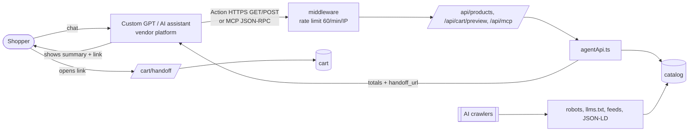
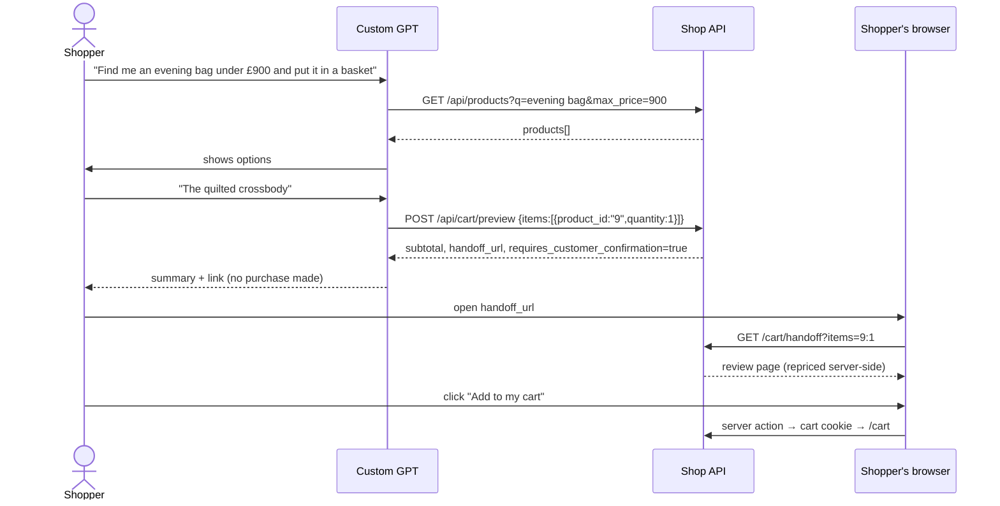

# 05 — GPT Bots and External Agent Integration

## 1. Scope and status

The repository contains **no Custom GPT definition, no GPT Action configuration, no OAuth flow and no API-key scheme**. What it does provide is the *server side* an external GPT or MCP client would need: a public **OpenAPI 3.1 document**, a **REST API**, an **MCP server**, **llms.txt**, feeds and JSON-LD. Whether a real Custom GPT has been configured against it is **Not documented in the repository — To validate**.

| Item | Status | Evidence |
|---|---|---|
| OpenAPI document for Actions | **Implemented** | `GET /openapi.json` (`src/app/openapi.json/route.ts`) |
| REST catalog + cart preview | **Implemented** | `src/app/api/products/*`, `src/app/api/cart/preview/route.ts` |
| MCP server (JSON-RPC 2.0 over HTTP POST) | **Implemented** | `src/app/api/mcp/route.ts` |
| Agent discovery files | **Implemented** | `llms.txt`, `llms-full.txt`, `feed/products.{json,xml}`, `sitemap.ts` |
| Crawler policy by bot type | **Implemented** | `src/app/robots.ts`, `src/lib/bots.ts` |
| Bot traffic log + dashboard | **Implemented** | `recordBotVisit`, `/api/ai/bots`, `/admin/bots` |
| Authentication / OAuth / API keys for agents | **Not implemented** | Public endpoints |
| Per-user actions (order, account) | **Not implemented** | — |
| Custom GPT / Action manifest, privacy policy URL | **Not implemented** | Needed to publish a GPT (**Proposed**) |

## 2. Three interaction models — do not confuse them

| Model | Who runs the LLM | Where the conversation lives | This project |
|---|---|---|---|
| **Embedded site assistant** | The shop's backend calls its own LLM provider | Shop UI (`AssistantChat`), history in browser `sessionStorage` | **Implemented** (`/api/ai/chat`) |
| **Server-side assistant** (Enthusiast agents) | Enthusiast worker (Celery) calls providers with tools | Enthusiast conversation API; the browser holds only a signed `conversation_ref` | **Implemented** for search and chat when `AI_BACKEND=enthusiast` (Product Search agent) |
| **External GPT / MCP client** | The vendor's platform (OpenAI, Anthropic, …) | The vendor's UI; the shop only sees tool calls | **Server side implemented**; client configuration external |

Consequence: with an external GPT the shop **does not control the model, prompt, or transcript**. It can only control what its API returns and what it allows the agent to do — which is why the API is read-only and returns explicit confirmation hints.

## 3. Architecture



## 4. Endpoints and contracts

All base URL: `URL` env var (default `http://localhost:3000`, `src/lib/site.ts`). Currency GBP; `price` in pounds (agent shape) — note the AI-search endpoint uses **pence** (`price`) plus `price_formatted`.

### 4.1 `GET /api/products`

Query: `q` (≤200), `category` (≤40), `min_price`, `max_price` (GBP), `limit` (1–50, default 10), `offset`.

```json
{
  "total": 3,
  "products": [{
    "id": "9", "sku": "QCB-0009", "name": "Quilted Crossbody Bag",
    "description": "…", "price": 899, "currency": "GBP",
    "categories": ["Bags", "Accessories"],
    "image_url": "https://…", "url": "https://<host>/products/9", "in_stock": true
  }],
  "limit": 10, "offset": 0
}
```

Errors: `400 {"error":"Invalid query","details":[…]}`; `429` from middleware. CORS `*`; `Cache-Control: public, max-age=60`. (The SKU value above is illustrative of the format `deriveSku` produces.)

### 4.2 `GET /api/products/{id}` — one product in the same shape; `404` if unknown.

### 4.3 `POST /api/cart/preview`

```json
// request
{ "items": [ { "product_id": "9", "quantity": 1 }, { "product_id": "3", "quantity": 2 } ] }
```
```json
// response
{
  "currency": "GBP",
  "items": [ { "product": { … }, "quantity": 1, "line_total": 899 } ],
  "subtotal": 899,
  "errors": [],
  "requires_customer_confirmation": true,
  "handoff_url": "https://<host>/cart/handoff?items=9%3A1%2C3%3A2",
  "note": "Prices are read from the shop's catalog. … The customer must open handoff_url to review and confirm."
}
```

Validation: 1–10 lines, quantity 1–10, product id ≤20 chars. **The caller never supplies a price.** No state is created.

### 4.4 MCP `POST /api/mcp`

- Methods: `initialize` (echoes a supported protocol version: 2025-06-18, 2025-03-26, 2024-11-05), `ping`, `tools/list`, `tools/call`; notifications return `202`; batches up to 20; `GET` returns `405`.
- Tools: `search_products`, `get_product`, `build_cart` (schemas in `TOOLS`).
- `initialize.instructions` tells clients to *"Never claim a purchase was made: the customer confirms through handoff_url."*
- Errors follow JSON-RPC (`-32700`, `-32600`, `-32601`, `-32602`, `-32603`); bad tool arguments return a tool result with `isError: true`.
- **Origin check:** requests with an `Origin` different from `siteUrl()` are refused with 403 (DNS-rebinding guard); requests without `Origin` (non-browser agents) are allowed.

Example:

```json
{"jsonrpc":"2.0","id":1,"method":"tools/call",
 "params":{"name":"build_cart","arguments":{"items":[{"product_id":"9","quantity":1}]}}}
```

### 4.5 Discovery

| URL | Purpose |
|---|---|
| `/openapi.json` | Import into a GPT Action |
| `/llms.txt`, `/llms-full.txt` | LLM-friendly site map and catalog in Markdown |
| `/feed/products.json`, `/feed/products.xml` | Structured feed; XML follows Google Merchant RSS (brand from `STORE_BRAND`) |
| `/sitemap.xml`, `/robots.txt` | Crawling policy; training bots follow `AI_TRAINING_BOTS` (`allow` default) |
| Product page JSON-LD | `Product`, `BreadcrumbList`, `ItemList`, `Organization`, `WebSite` with `SearchAction` |

Not agent-facing: `/api/products/dump` (Enthusiast import; guarded by `ENTHUSIAST_TOKEN` only when that variable is set) and `/api/ai/*` (the shop's own UI).

## 5. Sequence — Custom GPT builds a cart



## 6. Security posture for agent access

| Control | Status |
|---|---|
| Read-only tools; no mutation reachable by agents | **Implemented** |
| Server-side pricing; client cannot set prices or totals | **Implemented** |
| Human confirmation for cart addition | **Implemented** (`handoff_url` + click) |
| Rate limit | **Partial**: 60/min/IP, in-memory, keyed on `x-forwarded-for` (agents behind shared vendor IPs share a bucket; spoofable without a trusted proxy) |
| MCP origin check | **Implemented** |
| Authentication, scopes, per-agent identity | **Not implemented** |
| Consent / delegation model ("this agent may act for me") | **Not implemented** |
| Audit trail of agent calls | **Partial**: only *known AI-bot user agents* are logged (path + UA, last 200); no request payloads, no per-call audit |
| Injection risk from tool output | Tool output is catalog text; agents should treat it as data (MCP `instructions` reminds them) |
| Handoff link integrity | Link contains only ids and quantities; totals are recomputed on open, so tampering cannot change price. It can add up to 10 lines of ≤10 units of *any* catalog product |

Robots rules are advisory and are not access control.

## 6b. Known issues for GPT integration

1. **CORS:** `/api/products` allows `*`; `/api/cart/preview` and `/api/mcp` set no CORS headers. Server-to-server Actions do not need them; browser-based clients would.
2. **Absolute URLs depend on `URL`.** If it is unset behind a proxy, `handoff_url` and `url` fields point to `http://localhost:3000`.
3. **Stock is not real.** Every product returns `in_stock: true`; an agent may promise availability the shop cannot guarantee. Should be surfaced in the API description (**Proposed**).
4. **`llms.txt` says** "add `&ai=true`" for AI search; that path needs `AI_ENABLED=true`, otherwise it silently behaves like classic search.

## 7. Proposed evolution (not implemented)

**Proposal A — publish a Custom GPT:** add `openapi.json` auth (API key in header) and a privacy-policy page; provide GPT instructions ("always give `handoff_url`; never state stock as guaranteed").
**Proposal B — agent identity:** issue per-agent API keys with quotas; log each call (agent id, tool, latency) for KPIs.
**Proposal C — authenticated shopper context:** OAuth 2.1 so an agent can read *the shopper's* cart or order status, with scopes (`catalog.read`, `cart.preview`, `orders.read`) and explicit consent screens. Any write scope (order, refund) must keep human confirmation.
**Proposal D — agent commerce protocols:** evaluate emerging checkout protocols once real checkout exists; out of scope today.
